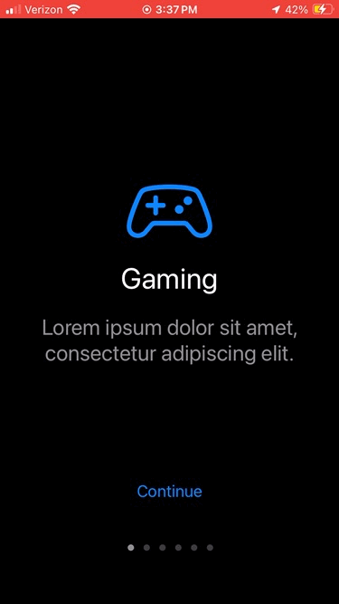

# Onboarding

## About
I needed to add some simple onboarding cards to another app I have been working on, and I could not find anything that was quite what I wanted, so I created this app. If you like it or found it useful, I would appreciate if you starred it or even shared it with your friends. I don't expect to work on this too much more, as I am quite satisfied with the end result.

## Acknowledgments
My app is roughly based on this [tutorial](https://www.youtube.com/watch?v=cpg7f4pVzFw) by iOS Academy that uses SwiftUI for a simple onboarding app. However, I needed to use UIKit, so I basically converted their app from SwiftUI, and added some of my own features.

## Usage
Everytime the app is launched, the onboarding cards should appear, with an icon, header, and text. Navigate through them by pressing `Continue`, swiping left and right, or scrolling through the pagination dots. Once you have reached the last page, hitting `Continue` takes you to what would theoretically be the main section of your app. Here, it is simply a button that allows you to start over. There is also a skip button in the top left for convenience. 

## Implementation
To add this into your own app, simply copy the code from the`.Swift` files into your existing project. In your own `Main.Storyboard`, create a new view controller, and set its class to be `OnboardingViewController`. Then change the data inside `Onboarding.Swift`, where icon can be any SF Symbol, to fit your app. Right now, the data is just some placeholder lipsum text. You can change the number of pages by simply adding or deleting `OnboardingData` structures. Lastly add a segue to your main view controller from the onboarding view controller with the identifier `toMainView`.

## Installation
1. Clone this repository or download it as a zip folder and uncompress it.
2. Open up the `.xcodeproj` file, which should automatically launch Xcode.
3. You might need to change the signing of the app from the current one.
4. Click the `Run` button near the top left of Xcode to build and install.

#### Prerequisites
Hopefully this goes without saying, but you need Xcode, which is only available on Macs.

#### Notes
You can run this app on the Xcode simulator or connect a physical device.  
The device must be either an iPhone or iPad running iOS 16.0 or newer.

## SDKs
* [UIKit](https://developer.apple.com/documentation/uikit/) - Construct and manage a graphical, event-driven user interface for your iOS, iPadOS, or tvOS app.
* [Swift](https://developer.apple.com/swift/) - A powerful and intuitive programming language for all Apple platforms.

## Bugs
If you find one, feel free to open up a new issue or even better, create a pull request fixing it. But then again, this app is extremely simple, so I don't expect for there to be any.

## Contributors
Sachin Agrawal: I'm a self-taught programmer who knows many languages and I'm into app, game, and web development. For more information, check out my website or Github profile. If you would like to contact me, my email is [github@sachin.email](mailto:github@sachin.email).

## License
This package is licensed under the [MIT License](LICENSE.txt).
